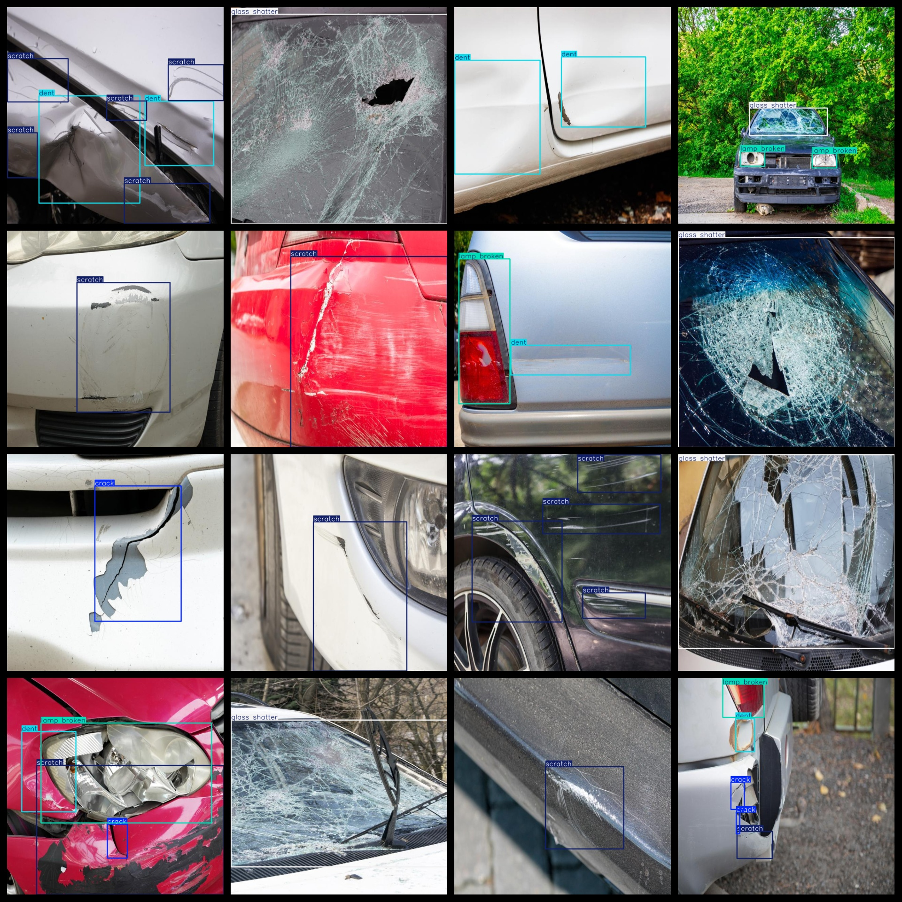
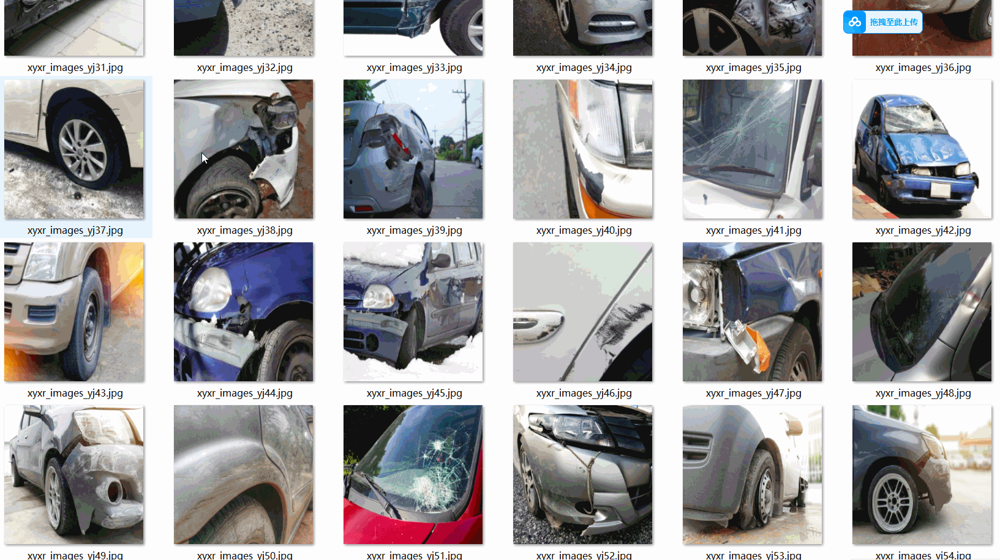

# Vehicle Defect Detection Dataset
4000 images in 6-class defect VOC+YOLO format

The dataset is in the format of VOC and YOLO.

The package contains three directories, each storing images, xml files, and txt files.

In the JPEGImages folder, there are a total of 4000 jpg images.

In the Annotations folder, there are a total of 4000 xml files.

In the labels folder, there are a total of 4000 txt files.

There are 6 types of labels: ["crack", "dent", "glass shatter", "lamp broken", "scratch", "tire flat"]

The labels are as follows: ["Crack", "Dent", "Glass Chip", "Light Out", "Scratch", "Tire Blowout"]

The number of boxes per label (note that the order of categories in the YOLO format does not correspond to this, but it is based on the classes.txt file in the labels folder):

- crack boxes = 898
- dent boxes = 2543
- glass shatter boxes = 681
- lamp broken boxes = 704
- scratch boxes = 3595
- tire flat boxes = 319
- total boxes = 8740

The resolution of the image clarity is clear.

The image has not been enhanced.

The shape of the labels is rectangular boxes, used for target detection recognition.

Important Notice: No guarantee is made about the accuracy or weights of the trained models or the dataset. The dataset only provides accurate and reasonable annotations.

Annotations and picture conditions are as follows:
## Images

---

Here is a pay link on Stripe (https://buy.stripe.com/3cs8yP7sY87d0vu9AB). Please contact me lonlonago@foxmail.com after funding $89, and I will send you a complete data files, thank you!

